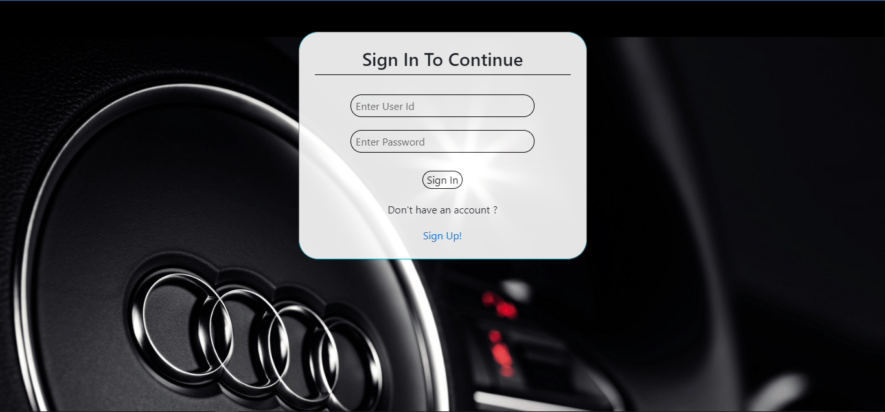

# Car_Becho
It is a online web application using which we can be used to buy or sell our used cars.It also estimates price of used car based on some parameter. User has to give certain inputs regarding the car and the system will generate a estimated fare range.

# Technology Used
Html, CSS, Bootstrap, Javascript, JQuery, Node.Js, Mongo DB, Express.js.

# Author
Satyajit Das

Smita

# Preview

https://optimistic-jang-15ee9c.netlify.com/frontend/login.html

# Screenshots

